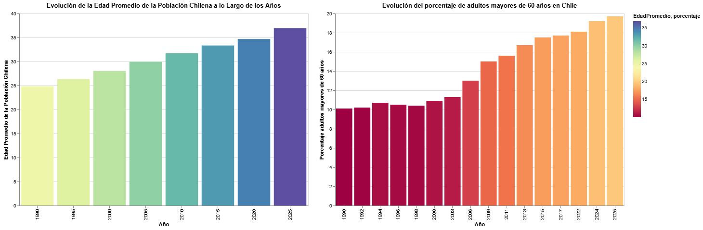

## La reconfiguración de la vejez en Chile

- *María, con sus 80 años, camina por las calles de Santiago con la calma de quien ha vivido más de lo que imaginó. La jubilación le regaló más tiempo, pero también le ha traído varios problemas: una pensión escasa, la soledad de los días y una ciudad que cambia a su alrededor, mientras su generación se hace cada vez más numerosa. En el eco de esos años que se suman, siente el peso de un Chile envejecido y sin en apoyo de una limitada población juvenil desafiada por solucionar las complicaciones que aquejan a sus mayores*.

[En formato dinámico](/Entrega04/Inostroza_Integrante_03_Constanza_vis_01/Visualización.md/Visualización.html)

<a href="file:///C:/Users/hp/Desktop/GR%C3%81FICA/grupo/Entrega04/Inostroza_Integrante_03_Constanza_vis_01/Visualizaci%C3%B3n.md/Visualizaci%C3%B3n.html" target="_blank">Visitar Visualización</a>

